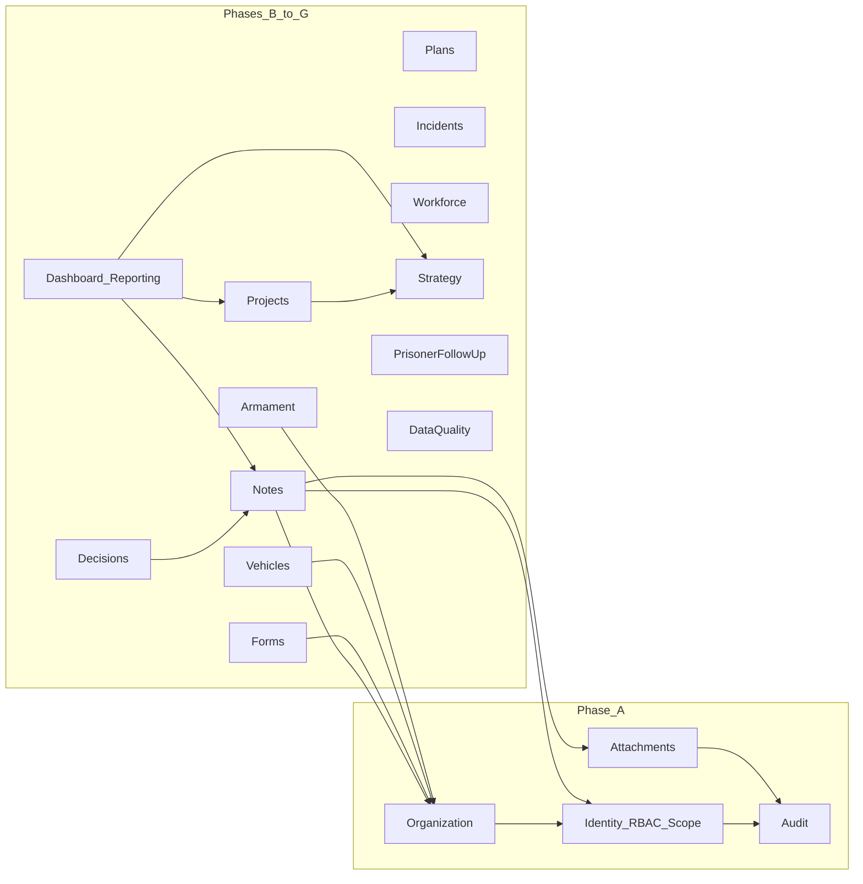

# الوحدات والعلاقات والمخاطر

## مخطط الوحدات (Modular Monolith)

## علاقات النطاق

كل سجل تشغيلي يرتبط بنطاق عبر `IScopedEntity` أو جداول ربط متعددة المواقع:

- Global / Headquarters / Region / Facility / FacilityUnit
- MultipleRegions / MultipleFacilities للمشاريع والخطط والنماذج والقرارات

## المخاطر التقنية والأمنية

| المخاطر | التخفيف في المرحلة A |
|---------|----------------------|
| IDOR بتغيير معرف السجن في URL/API | فلترة نطاق إلزامية في Application + اختبارات عزل |
| تسريب عبر إخفاء UI فقط | سياسات Authorization على كل endpoint |
| تعديل AuditLog | لا API تحديث/حذف؛ إدراج عبر خدمة بنية تحتية فقط |
| مرفقات خبيثة | قائمة MIME، حد حجم، اسم آمن، SHA-256، صلاحية تنزيل مستقلة |
| اعتماد Entra غير مُعد | TestAuth للاختبارات؛ توثيق إعدادات الإنتاج |
| كتابة فوق تعديلات متزامنة | RowVersion + Optimistic concurrency |
| بيانات حساسة لـ AI خارجي | ممنوع بالسياسة؛ لا تكامل AI في المنصة |

## افتراضات محافظة

1. تخزين المرفقات محليًا في التطوير؛ واجهة `IFileStorage` قابلة للاستبدال.
2. Seed هيكلي للتطوير/الاختبار فقط داخل Infrastructure.
3. التوقيت: تخزين UTC، عرض Asia/Riyadh.
