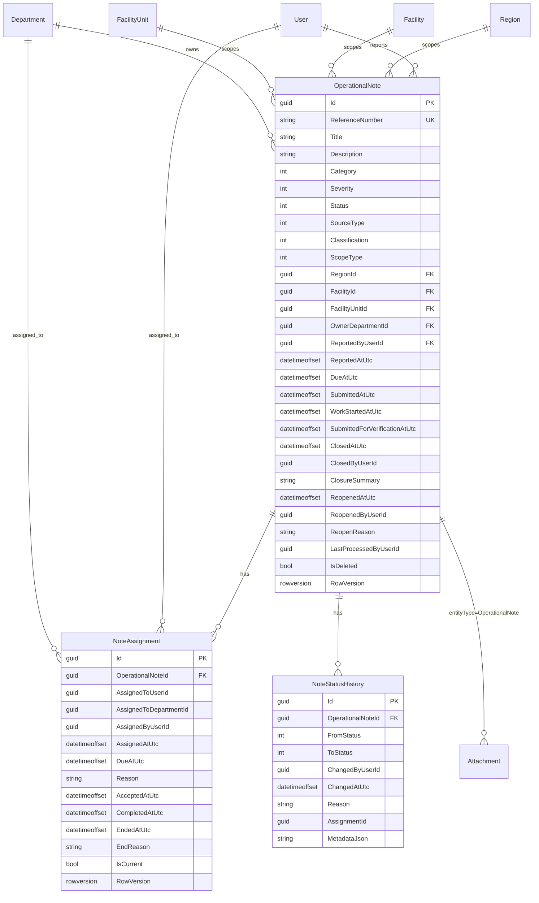

# Phase B.1 — Domain Model

## ERD

## Entities

| Entity | Base | Purpose |
|--------|------|---------|
| `OperationalNote` | `SoftDeletableEntity`, `IScopedEntity` | Core operational observation |
| `NoteAssignment` | `EntityBase` | Current and historical assignments (no hard delete on reassign) |
| `NoteStatusHistory` | plain | Append-only visible workflow timeline (separate from `AuditLog`) |

## Relationships

- Note → Assignments: 1:N, `DeleteBehavior.Restrict`
- Note → StatusHistory: 1:N, `DeleteBehavior.Restrict`
- Assignment target: **exactly one** of `AssignedToUserId` XOR `AssignedToDepartmentId` (DB check)
- One current assignment per note: filtered unique index `IsCurrent = 1`

## Indexes

- Unique: `ReferenceNumber`
- Filtered unique: `(OperationalNoteId)` where `IsCurrent = 1`
- Query: `Status`, `Severity`, `DueAtUtc`, `RegionId`, `FacilityId`, `FacilityUnitId`, `OwnerDepartmentId`, `ReportedByUserId`, `CreatedAtUtc`
- History: `(OperationalNoteId, ChangedAtUtc)`

## Check constraints

| Name | Rule |
|------|------|
| Supported scopes | `ScopeType IN (0,1,2,3,4)` — Global/HQ/Region/Facility/FacilityUnit |
| Global/HQ | no Region/Facility/Unit ids |
| Region | RegionId required; Facility/Unit null |
| Facility | FacilityId required; Unit null |
| FacilityUnit | FacilityId + FacilityUnitId required |
| Assignment XOR | user XOR department (not both, not neither) |

## Soft delete

- Operational notes: global query filter `!IsDeleted`; archive/restore via dedicated endpoints
- No hard delete for notes, assignments, or status history
- Soft-deleted notes reject new attachments

## RowVersion

- `OperationalNote` and `NoteAssignment` use optimistic concurrency
- Clients send Base64 `rowVersion`; conflicts → HTTP 409

## Reference number

- SQL sequence: `OperationalNoteReferenceSequence`
- Format: `OBS-00000001` (`NoteReferenceFormatter`)
- Immutable after create; unique index; never reused for archived rows
- Concurrent create covered by integration test
