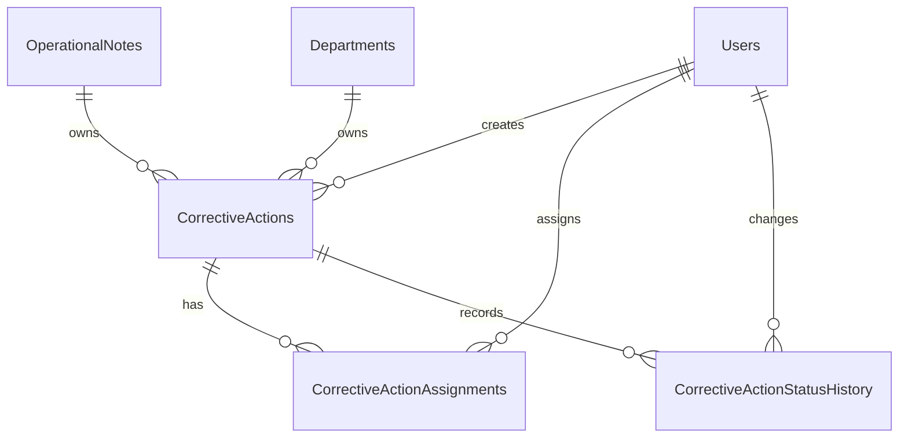

# Phase B.2.1 — Domain Model

## ERD

## Entities

`CorrectiveAction`

- Soft-deletable operational entity with `RowVersion`.
- Required `Title` and `Description`.
- Immutable `ReferenceNumber` generated by SQL sequence as `CA-########`.
- Required `OperationalNoteId`; note relationship uses `DeleteBehavior.Restrict`.
- Status lifecycle fields are only changed by command/workflow services.
- `DueAtUtc` is stored in UTC and cannot precede creation.
- Classification defaults to the parent note and cannot be lower.

`CorrectiveActionAssignment`

- Assignment history for user or department targets.
- Check constraint enforces exactly one of `AssignedToUserId` and `AssignedToDepartmentId`.
- Filtered unique index allows only one current assignment per corrective action.
- Reassignment ends the current row and inserts a new row; previous rows are retained.

`CorrectiveActionStatusHistory`

- User-visible timeline, separate from AuditLog.
- Append-only: DbContext rejects update/delete attempts.
- No update or delete API is exposed.

## Tables and Constraints

- `CorrectiveActions`
- `CorrectiveActionAssignments`
- `CorrectiveActionStatusHistory`
- Sequence `CorrectiveActionReferenceSequence`
- Unique index on `CorrectiveActions.ReferenceNumber`
- Filtered unique index on current assignments
- XOR check constraint on assignment target
- Restrict foreign keys to avoid cascade hard delete
- Query filters hide soft-deleted corrective actions

## Indexes

Indexes cover note relationship, status, priority, due date, owner department, creator, created time, soft delete, and overdue-style `Status + DueAtUtc` queries.

## Scope Binding

Corrective actions do not store independent `RegionId`, `FacilityId`, or `FacilityUnitId`. Every scope decision is resolved through the parent `OperationalNote`, preventing scope drift between note and action.
